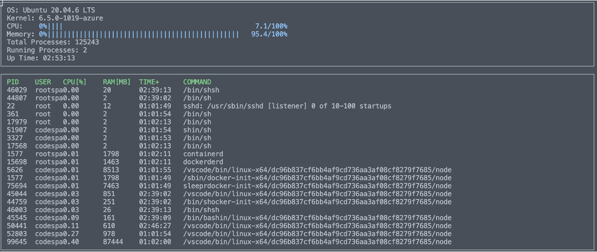

# CppND-System-Monitor-Project
This repository contains C++ code to build a simple system monitoring system in a Linux-based system. This is a project from the Object Oriented Programming Course of the Udacity C++ Nanodegree program.

